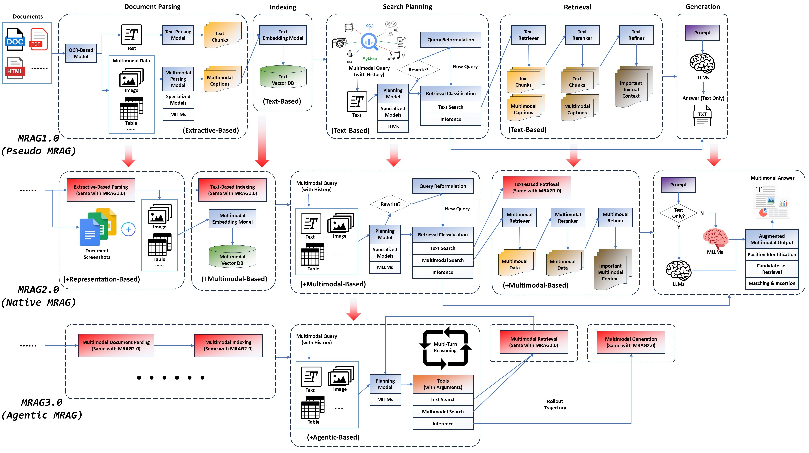

# MRAGSurvey


> A collection of papers and resources related to Large Language Models. 
>
> The organization of papers refers to our survey [**"A Survey of Multimodal Retrieval-Augmented Generation"**](https://arxiv.org/abs/2504.08748). 
>
> Please let us know if you find out a mistake or have any suggestions by e-mail:  chenchong55@huawei.com
>
> (we suggest ccing another email meilang1@huawei.com meanwhile, in case of any unsuccessful delivery issue.)
>
>
> If you find our survey useful for your research, please cite the following paper:

```
@article{mei2025survey,
  title={A Survey of Multimodal Retrieval-Augmented Generation},
  author={Mei, Lang and Mo, Siyu and Yang, Zhihan and Chen, Chong},
  journal={arXiv preprint arXiv:2504.08748},
  year={2025}
}
```

## Overview of MRAG



### MRAG1.0

The architecture of MRAG1.0, often termed "pseudo-MRAG", closely resembles traditional RAG, consisting of three modules: Document Parsing and Indexing, Retrieval, and Generation. While the overall process remains largely unchanged, the key distinction lies in the Document Parsing stage. In this stage, specialized models are employed to convert diverse modal data into modality-specific captions. These captions are then stored alongside textual data for utilization in subsequent stages.


### MRAG2.0

The architecture of MRAG2.0 retains multimodal data through document parsing and indexing, while introducing multimodal retrieval and MLLMs for answer generation, truly entering the multimodal era.


### MRAG3.0

MRAG3.0 architecture integrates document screenshots during the document parsing and indexing stages to minimize information loss. At the input stage, it incorporates a Multimodal Search Planning module, unifying Visual Question Answering (VQA) and Retrieval-Augmented Generation (RAG) tasks while refining user query precision. At the output stage, the Multimodal Retrieval-Augmented Composition module enhances answer generation by transforming plain text into multimodal formats, thereby enriching information delivery.


## Table of Contents

Coming......


## Paper List

Coming......
